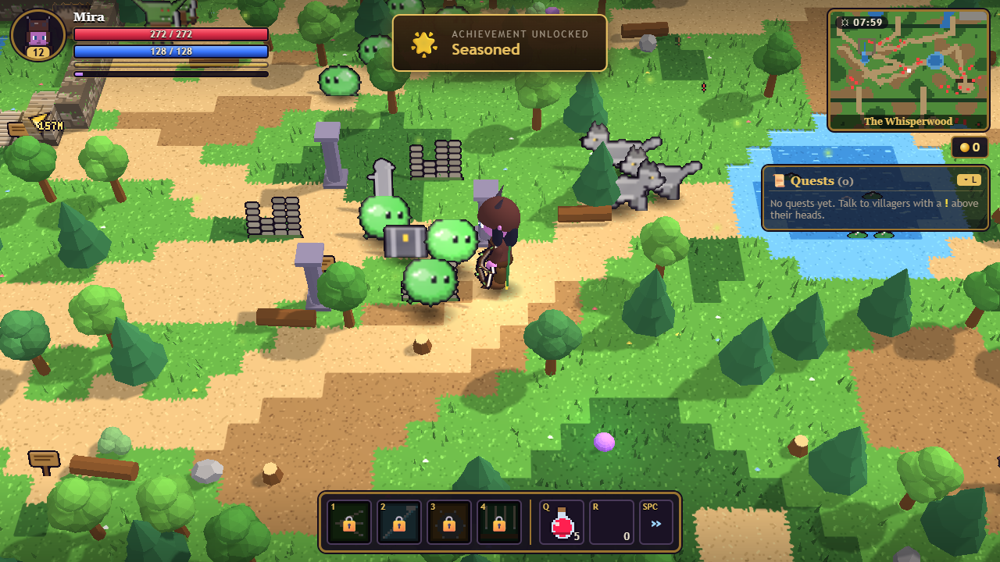
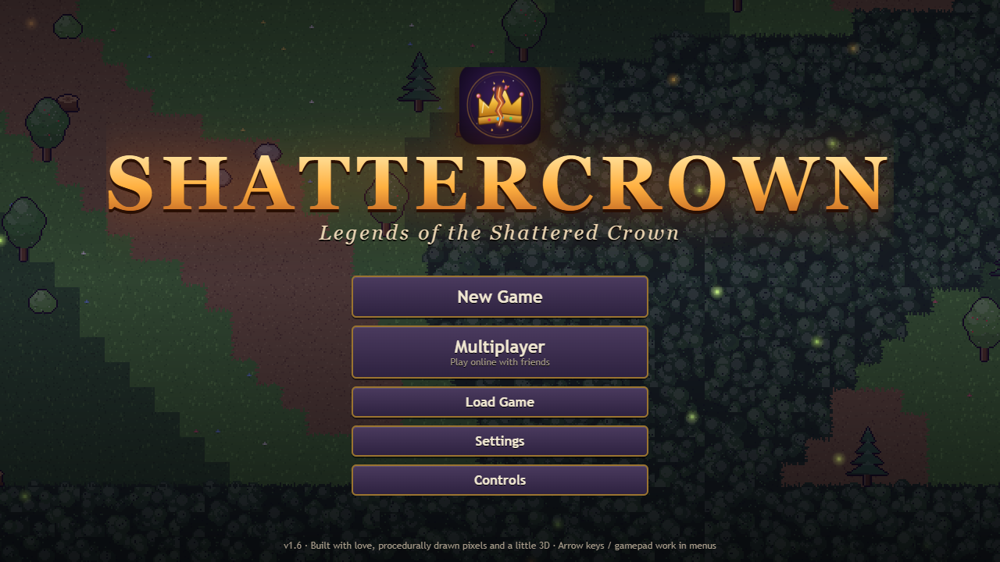
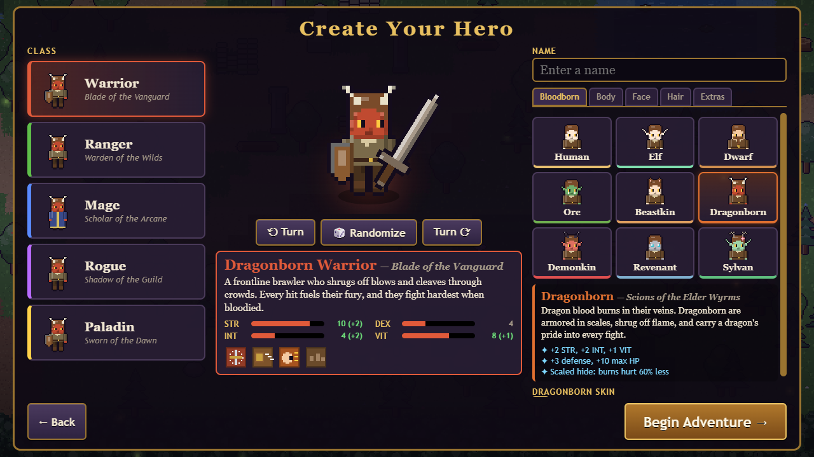
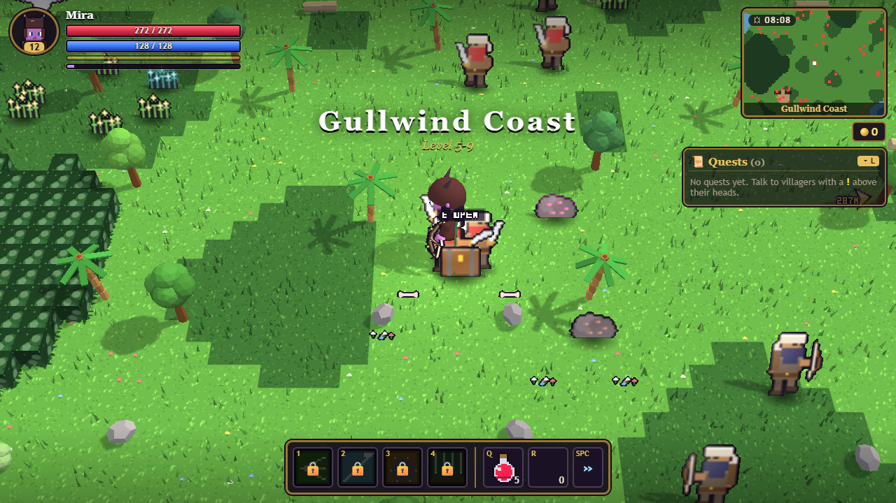
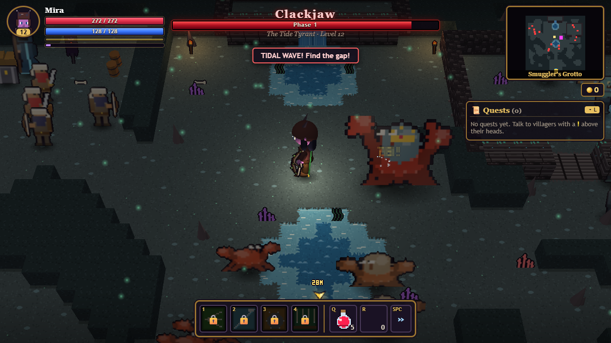

# Emberfall: Legends of the Shattered Crown

A 2D pixel-art action RPG you can play **solo or online with up to 3 friends**. Pick from 5 classes and 9 races, customise your hero, explore 18 regions, fight 11 bosses that come back harder every time you beat them, and hunt for secrets.



## ⬇️ Download (Windows)

### [**Download the latest version here**](https://github.com/Camells1/Emberfall/releases/latest)

On that page, click **`Emberfall-Setup-….exe`** under *Assets*, run it, and you're done. The installer includes everything, online play too. It adds Emberfall to your Desktop and Start menu.

> **"Windows protected your PC"?** The installer isn't code-signed (that costs money), so Windows SmartScreen may warn you the first time. Click **More info → Run anyway**.

## 🎮 Play with friends

Everyone needs the same version of the game and an internet connection. No accounts, no extra apps, no router settings.

1. **Host:** click **Multiplayer** on the title screen, pick your character, then click **Host**. You get a 5-letter **room code**.
2. **Friends:** click **Multiplayer**, pick *their own* character, type the code and click **Join**. (In game it's also under **Esc → Multiplayer**.)
3. That's it: you're in the host's world. Everyone keeps their own character, gear, XP, loot and quests. Monsters chase whoever is closest, and the party follows the host between areas.

Up to 4 players. You can set an optional password when hosting. (There's also a direct-IP option under *Advanced* for LAN or Tailscale.)

## Screenshots

| | |
|---|---|
|  |  |
|  |  |

## Features

- **Huge open world**: every outdoor region is about ten times bigger, with roads, outposts (waypoints + crafting), forts, champions, ruins, lakes, wishing wells, standing stones and hidden chests. The further from town, the tougher the monsters.
- **Online co-op for up to 4** with room codes and optional passwords. Everyone can go anywhere, drop items for each other or send items and gold with "Give to".
- **PvP arena** (the Crimson Colosseum, just west of Havenbrook), plus a solo **Gauntlet** of five monster waves
- **5 classes** and **17 Bloodborn races** (Human, Elf, Dwarf, Orc, Beastkin, Dragonborn, Demonkin, Revenant, Sylvan, Gnome, Merfolk, Celestial, Forged, Nightborn, Fae, Minotaur, Lizardfolk)
- **Learnable skills**: 30 extra skills from trainers and quests. Put any 4 on your skill bar.
- **Crafting**: gather herbs, ore and timber, brew potions, forge gear, **enchant** it (16 enchantments) and salvage what you don't need
- **11 mounts** with their own special abilities and **16 pets** that follow you and fetch loot
- **11 bosses**, each with its own attacks, animations and movement, plus phases, shields, enrage timers and endless **Challenge Sigil** rematches
- **Custom crosshairs**, deep character customisation, difficulty levels from Story to Hell, 60+ quests and hundreds of items
- Everything (art, sound and music) is generated in code. There are no asset files.
- A few easter eggs. Be nice to the hens.

## Controls

| Action | Keys |
|---|---|
| Move / aim | WASD · mouse |
| Attack / heavy attack | Left click · right click |
| Dodge roll | Space |
| Sprint | Shift |
| Skills | 1 2 3 4 |
| Potions | Q (health) · R (mana) |
| Interact / talk | E |
| Inventory · skills · quests · map | I · K · L · M |
| Crafting recipes | B |
| Ride / dismount · mount ability | H · Space (while riding) |
| Stable (mounts & pets) | N |
| Admin panel (level 30) | F10 |
| Menu | Esc |

Gamepads work too.

## Changelog

### v1.4.1
- Flying mounts: the Ember Drake and the new Sky Gryphon (Rosa's stable, level 15) fly over trees, rocks and water
- Mounts now face up and down as well as left and right
- The admin panel's tools unlock at level 30, and its settings are saved per game
- The stable (N), admin, crafting and skills menus scroll

### v1.4
- Every outdoor region is about 10x bigger, with new points of interest, outposts and waypoints
- Free-roaming co-op, shared item drops, "Give to" for items and gold, room passwords, and a Multiplayer button on the title screen
- The Crimson Colosseum PvP arena and the Gauntlet
- Crafting, gathering, enchanting and salvaging
- Unique mechanics and animations for every boss
- 30 learnable skills from trainers and quests, and a customisable skill bar
- Mounts with abilities, pets, and a stable
- 8 new races (17 total)
- Custom crosshairs, smoother movement, and an admin panel

### v1.3

- **Online co-op for up to 4 players.** Click Multiplayer on the title screen (or Esc → Multiplayer in game). The host clicks **Host** and gets a 5-letter room code; friends type it into **Join**. Nothing else to install, no router setup. Everyone keeps their own character, loot, XP and quests; monsters target whoever is closest, and the party follows the host between areas. (Direct IP connections for LAN/Tailscale are under "Advanced".)
- **Bigger world.** Nine outdoor maps grew by roughly a third to a half: Havenbrook Outskirts, Fernhollow Glades, the Drowned Hamlet, the Glass Canyons, Skyreach Glacier, the Ashen Wastes, Gull Downs, Wildheart Thicket and the Palm Gardens. New cliffs, ruins, monster dens, camps, shrines that bless you, fishing spots, hidden chests (not all of them are chests...) and discovery XP for finding each new area.
- **Easter eggs.** A few. Be nice to the hens.

### v1.2

- **Much harder bosses**: four phases (70% / 40% / 15%), each with a shockwave, a damage shield you have to break, reinforcements and faster attacks; new nova and sweeping-beam attacks; an enrage timer; boss hits pierce half your armor; and boss health scales with your gear, so over-geared heroes still get a real fight. Potions have a 3-second cooldown during boss fights.
- **Boss tiers**: after you beat a boss, a Challenge Sigil appears where it fell. Each rematch is one tier higher (more health, harder hits, faster attacks) with bigger rewards. Tiers never stop.
- **Difficulty levels** in Settings: Story, Normal, Hard, Nightmare and Hell.
- **Fixes**: your arrows and spells now hit enemies anywhere on their body (tall bosses used to only be hittable through the middle), and enemy healers can no longer fully heal bosses.

### v1.1

- **Bloodborn races**: Human, Elf, Dwarf, Orc, Beastkin, Dragonborn, Demonkin, Revenant and Sylvan, each with its own look and stat bonuses.
- **Deeper customization**: four body types, 18 hairstyles, 8 beards, eye styles, ears, horns, face markings, accessories, dozens of colours plus a custom colour picker for everything. Mirabel the Stylist in Havenbrook can restyle you later.
- **New regions**: Gullwind Coast and the Smuggler's Grotto (south of Havenbrook), the Glimmercap Hollows (a sinkhole in the Mirefen), the Thornveil Grove (west of Frostfang) and the post-game Starfall Rift (behind Malgrath's throne). Four new bosses, 23 new monsters, a Starforged gear tier.
- **Cliffs and plateaus** with stone stairs and waterfalls, in the new regions and in the Whisperwood, Frostfang and the dunes.
- **31 new quests**, including repeatable bounties on the Havenbrook notice board.
- **Smarter enemies**: pathfinding around walls and cliffs, taking turns to attack and circling you, waking nearby allies, dodging arrows and spells, fleeing when badly hurt, leading their shots, and getting staggered by heavy hits.
- **Better animation**: 6-frame walk and run cycles, breathing and blinking, 3-stage attacks, flinching, falling on death, cape and hair sway, and squash-and-stretch on monsters.
- **Villager chatter** in speech bubbles, new music for each region.
- **Menu fixes**: Esc goes back instead of closing everything, menus no longer flicker when you click, keyboard and gamepad menu navigation, no stuck tooltips, the boss bar no longer sticks after dying, buttons no longer keep focus (Space used to re-press them), and the Fullscreen setting stays in sync with F11.

## Building from source

You need [Node.js](https://nodejs.org) 18 or newer.

```sh
npm install
npm start          # run the game
npm run dist:win   # build the Windows installer into dist/
```

You can also open `web/index.html` in a browser to play single-player (online room codes work there too).

## How it's built

Plain JavaScript with no build step. `web/index.html` loads the scripts in order and everything hangs off one global, `RPG`.

| Folder | What's in it |
|---|---|
| `web/src/core` | Utilities, input, synthesized audio |
| `web/src/gfx` | Pixel-art renderer: characters, weapons, monsters, tiles and props, icons, particles and effects |
| `web/src/data` | Items, classes, races (`races.js`) and skills, enemies and bosses, NPCs, quests, maps, story; the v1.1 regions live in `regions.js` |
| `web/src/game` | Combat, entities, enemy AI and pathfinding (`nav.js`), world and collision, quest engine, saves |
| `web/src/ui` | HUD and menus (DOM layer over the canvas) |
| `main.js`, `netmain.js`, `preload.js` | Electron shell and co-op networking |

`DESIGN.md` has the content plan: zones, enemies, bosses and gear rules. Saves are kept in the browser's (or app's) local storage: three slots plus an autosave.

## Credits

Online play uses [PeerJS](https://peerjs.com) (MIT licence, bundled in `web/lib/`) and its free public matchmaking server.
